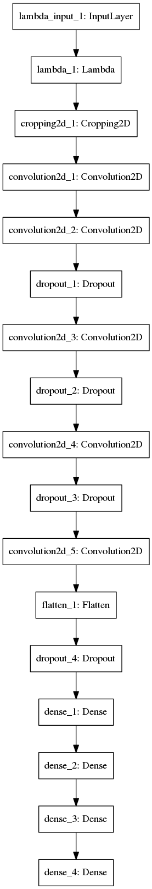
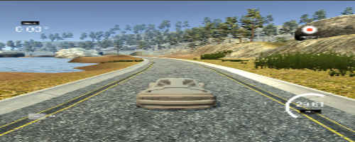

# **Behavioral Cloning** 


---

**Behavioral Cloning Project**

The goals / steps of this project are the following:
* Use the simulator to collect data of good driving behavior
* Build, a convolution neural network in Keras that predicts steering angles from images
* Train and validate the model with a training and validation set
* Test that the model successfully drives around track one without leaving the road
* Summarize the results with a written report


[//]: # (Image References)

[image1]: ./errorGraphics/fig1.png "Error Visualizaton 1"
[image2]: ./errorGraphics/fig2.png "Error Visualizaton 2"
[image3]: ./errorGraphics/fig3.png "Error Visualizaton 3"
[image4]: ./errorGraphics/fig4.png "Error Visualizaton 4"
[image5]: ./errorGraphics/fig5.png "Error Visualizaton 5"
[image6]: ./errorGraphics/fig6.png "Error Visualizaton 6"
[image7]: ./model.png "Final Model"
[image8]: ./lane_center.png "Lane Center"
[image9]: ./lane_left.png "Lane left"
[image10]: ./lane_right.png "Lane right"
[image11]: ./bright.png "Bright"
[image12]: ./dark.png "Dark"

---
### Files Submitted & Code Quality

#### 1. Submission includes all required files and can be used to run the simulator in autonomous mode

My project includes the following files:
* model.py containing the script to create and train the model
* drive.py for driving the car in autonomous mode
* model5.h5 containing a trained convolution neural network 
* writeup_report.md or writeup_report.pdf summarizing the results

#### 2. Submission includes functional code
Using the Udacity provided simulator and my drive.py file, the car can be driven autonomously around the track by executing 
```sh
python drive.py model5.h5
```

#### 3. Submission code is usable and readable

The model.py file contains the code for training and saving the convolution neural network. The file shows the pipeline I used for training and validating the model, and it contains comments to explain how the code works.

### Model Architecture and Training Strategy

#### 1. An appropriate model architecture has been employed

My model consists of a convolutional neural network with 5x5 and 3x3 filter sizes and depths between 24 and 64, dropout layers with 0.5 of probability and cropping layer.

The model includes ReLU layers to instroduce nonlinearity, and the data is normalized in the model using a Keras lambda layer.

At final, 1 neuron for regression and MSE as a loss function.

#### 2. Attempts to reduce overfitting in the model

The model was trained and validated on different data sets to ensure that the model was not overfitting. The model was tested by running it through the simulator and ensuring that the vehicle could stay on the track.

The model contains dropout layers in order to reduce overfitting. I did many changes to NVIDIA net.

In many cases, I solved overfitting problem but I got higher validation loss. 

- First Attempt:

NVIDIA net without Dropout Layers. In this case I got overfitting. We can see the curve of validation loss is greater than training loss.

Sequence of layers: Conv-Conv-Conv-Conv-Conv-FC-FC-FC-FC

![image1]

- Second Attempt:

NVIDIA net with Dropout Layers. In this case, I got overfitting. I put a dropout layer after Flatten. According to the results that I show below, I won't put Dropout regularization between Fully-Connected Layers.

Sequence of layers: Conv-Conv-Conv-Conv-Conv-Dropout-FC-FC-FC-FC

![image2]

- Third Attempt:

NVIDIA net with Dropout Layers. In this case I didn't get overfitting. It seems when you put Dropout regularizations  with a probability of 50% between Convolutional layers, it works. But with a little higher loss.

Sequence of layers: Conv-Conv-Dropout-Conv-Dropout-Conv-Dropout-Conv-Dropout-FC-FC-FC-FC

![image3]

- Fourth Attempt:

NVIDIA net with Dropout Layers. In this case I didn't get overfitting until 100 epochs. It does not look better than last attempt. We can see that there is more validation loss than last one.

Sequence of layers: Conv-Conv-Conv-Dropout-Conv-Dropout-Conv-Dropout-FC-FC-FC-FC

![image4]

- Fifth Attemp:

The architecture is the same as the third attempt. In this case we use 150 epochs instead of 100.

Sequence of layers: Conv-Conv-Dropout-Conv-Dropout-Conv-Dropout-Conv-Dropout-FC-FC-FC-FC

![image5]

- Sixth Attempt:

This architecture is the same as the third attempt. In this case I used Data augmenting in order to reduce loss function faster. However, the loss function was more.

Sequence of layers: Conv-Conv-Dropout-Conv-Dropout-Conv-Dropout-Conv-Dropout-FC-FC-FC-FC

![image6]

#### 3. Model parameter tuning

The model used an adam optimizer, so the learning rate was not tuned manually. 
The model was trained over 150 epochs.
The model used batch size 32.


#### 4. Appropriate training data

Training data was chosen to keep the vehicle driving on the road. I used a combination of center lane driving, recovering from the left and right sides of the road and doing smooth curves. Data for clockwise and counterclockwise driving was added. 5 laps by each way.


### Model Architecture and Training Strategy

#### 1. Solution Design Approach

My first step was to use LeNet model. I just wanted to verify the difference between this and NVIDIA net. The autonomous driving was not good. The car was hitting many times. 

My second step was to use a convolution neural network model similar to the NVIDIA neural network. I thought this model might be appropriate because it is used for real autonomous cars.

In order to gauge how well the model was working, I split my image and steering angle data into a training and validation set. I found that my first model had a low mean squared error on the training set but a high mean squared error on the validation set. This implied that the model was overfitting. 

In order to reduce memory space, I used generators because I was using about 35 000 images of float type.

To combat the overfitting, I modified the model so that I added some Dropout layers. First, I tried adding them between Fully-Connected layers but I got the same result. After, I added Dropout layers between Convolutional layers and It worked better.

Then, I decided to use data augmenting with a NVIDIA net with Dropout layers between Convolutional layers adding brightness and darkness but It does not worked.

The final step was to run the simulator to see how well the car was driving around track one. There were a few spots where the vehicle fell off the track due of overfitting. To improve the driving behavior in these cases, I added Dropout layer to reduce overfitting.

At the end of the process, the vehicle is able to drive autonomously around the track without leaving the road. 

#### 2. Final Model Architecture

The final model architecture (model.py lines 18-24) consisted of a convolution neural network with the following layers.

First, I used Lambda layer for normalizing data between -0.5 and 0.5 instead of 0-255, then I cropped every image 70 pixels from top to bottom and 25 from bottom to top.

The model is showed below.
- Convolutional layer, 24 of 5x5, subsample 2x2, activation relu
- Convolutional layer, 36 of 5x5, subsample 2x2, activation relu
- Dropout Layer, probability 0.5
- Convolutional layer, 48 of 5x5, subsample 2x2, activation relu
- Dropout Layer, probability 0.5
- Convolutional layer, 64 of 5x5, subsample 1x1, activation relu
- Dropout Layer, probability 0.5
- Convolutional layer, 64 of 5x5, subsample 1x1, activation relu
- Dropout Layer, probability 0.5
- Fully-Connected, 100 Neurons
- Fully-Connected, 50 Neurons
- Fully-Connected, 10 Neurons
- Fully-Connected, 1 Neuron

Here is a visualization of the architecture.

<div style="width:700px;height:300px;overflow:hidden;" >
       
    </div>

#### 3. Creation of the Training Set & Training Process

##### This is the data used for a good self-driving: https://drive.google.com/drive/folders/1CzkXRxHkskVnRd2nnqYxqeFbOvg1GvpV?usp=sharing

To capture good driving behavior, I first recorded two laps on track one using center lane driving. Here is an example image of center lane driving:

<div style="width:700px;height:300px;overflow:hidden;" >
       
    </div>

I then recorded the vehicle recovering from the left side and right sides of the road back to center so that the vehicle would learn to back to the center of the road if it is near to get off of the road. These images show what a recovery looks like.

<div style="width:700px;height:300px;overflow:hidden;" >
       
    </div>

<div style="width:700px;height:300px;overflow:hidden;" >
       
    </div>


Then I repeated this process on track two in order to get more data points.

To augment the data sat, I also increased brightness and darkness thinking that this would help to reduce the validation loss faster, but It did not work, so I did not use data augmenting for the final model. Then, I wanted to rotate, scale or translate the data set in order get better result, but I though that I would change the real value of angles. For example, If I have a car that is going to the right and I rotate counterclockwise, The algorithm would think that the car is going to the left. I worried about that.

For example, here is an image that has then been added brightness and darkness:

<div style="width:700px;height:200px;overflow:hidden;" >
       
    </div>

<div style="width:700px;height:200px;overflow:hidden;" >
       
    </div>


After the collection process, I had 35000 number of data points. I then preprocessed this data by normalization and cropping each image.

I finally randomly shuffled the data set and put 20% of the data into a validation set. 

I used this training data for training the model. The validation set helped determine if the model was over or under fitting. The ideal number of epochs was 100 as evidenced by the graphics at the beginning of the WriteUp. I used an adam optimizer so that manually training the learning rate wasn't necessary.
